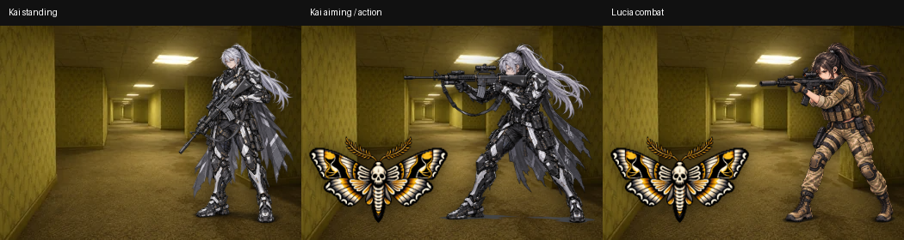

# Snapshot overlay normalization

Base inspected: `25d71f09b614bd9438766faf6deda8fb6489014e` (1.1.77).

## Cause and render path

`MainActivity.installUiScripts()` injects `snapshot-ui.js` after the HTML UI loads. `LevelCore.snapshotDescriptor()` supplies the background through `Android.levelSnapshot()`. `renderSnapshot()` creates the background and overlays; `backroomSetCombatVisualActor()` selects the combat participant. No native scale transformation is applied. `index.html` supplies the 250px snapshot height; the overlay stylesheet overrides the generic image rule. Background `object-fit:cover`/map `contain` remain unchanged.

The old layout measured alpha on a thumbnail at most 192px wide/high, then used `min(height budget / visible height, actor width budget / visible width)`. Standing Kai used 90% height, 58% width and a +5px foot offset. Aiming Kai used 84%/68%; Lucia used 84%/46%. Wide poses therefore had different effective heights even after padding normalization. Entry translation also briefly shifted sprites horizontally.

## Asset inspection

Bounds below are exclusive right/bottom, measured at full resolution with alpha > 8. All 19 Entity PNGs were inspected. The near-zero alpha residue in several PNGs makes alpha > 0 unsuitable for layout.

| Asset | Canvas | Paint bounds (left, top, right, bottom) |
|---|---|---|
| Kai standing | 1024×1536 | 46, 7, 1007, 1518 |
| Kai aiming/action | 1448×1086 | 163, 0, 1301, 1077 |
| Lucia combat | 1086×1448 | 20, 0, 1085, 1413 |
| Deathmoth | 1536×1024 | 11, 42, 1526, 985 |
| Hound | 128×128 | 3, 10, 126, 118 |

Iris/Syvial currently have silhouette placeholders, not registered sprite assets. Kai actions/skills reuse the aiming asset. Each current Entity has one registered sprite.

## New geometry

- Generate bounds and SHA-256 hashes from original bundled PNGs with Java ImageIO. Embed them in the renderer so `file:///android_asset/` never requires canvas readback. CI rejects stale metadata.
- Logical/body bounds use alpha > 128 to exclude faint padding/shadows. Paint bounds use alpha > 8 to retain translucent details. An entirely translucent sprite falls back to its paint bounds; an empty sprite has no layout.
- All bundled Character sprites share one synchronous metadata envelope: maximum paint width, head extent and shadow extent relative to logical height. No detached preloads or shared load barrier.
- Target logical height is 84% of snapshot height. Fit the shared envelope inside 2.5% side margins and 2% vertical safe edges. At unusually narrow aspect ratios the entire Character family reduces together. The pose's individual width never shrinks that pose alone.
- Place logical bottom at 92% of snapshot height: `top = ground - logicalBottom * scale`. Transparent lower padding changes the image element's top, not its feet. Preserve the original aspect ratio. Paint bounds determine side placement and combat feedback anchors.
- Entity retains its own 46% width lane and 84% maximum height, with no dependency on human proportions.
- ResizeObserver handles container-only resizes; a window resize fallback supports older WebViews. Placeholders share Character height/baseline. Entry animation fades without horizontal movement.



## Verification

```
node --test android-apk/tests/snapshot-layout.test.cjs
```

Five dependency-free Node tests cover padding invariance, common heights/anchors across seven aspect ratios, Entity sizing, alpha thresholds, empty/translucent sprites and zero-size containers. The existing APK workflow runs this test, replacing obsolete grep assertions that required the old offsets/width caps.

Optional browser verification (requires Playwright in the test environment; no production dependency):

```
node android-apk/tests/snapshot-browser.cjs
```

Set `CHROMIUM_EXECUTABLE_PATH` if using a local Chromium binary. This harness runs the actual renderer, changing only Android asset URLs to a local mocked origin and supplying the Android snapshot bridge/state. It writes screenshots/measurements to a temporary directory.

Verified: 36 combinations (six snapshot sizes × standing, aiming/action, Lucia, Iris placeholder, Syvial placeholder, Hound encounter), all 19 Entity sources loaded, combat feedback rendered, no JavaScript exceptions. Actual Character heights and alpha bounds were checked, including a narrow 240×400 snapshot. Existing 19 snapshot-specific CI checks and JavaScript syntax also passed.

## Limits

Chromium is not a physical Android WebView; on-device confirmation remains necessary. Alpha bounds are a reproducible visual-body approximation, not skeletal anatomy: a future crouched/flying pose or opaque shadow extending below the feet may need intentional logical anchors. Unknown/unregistered sprites fall back to visible canvas-sized bounds if alpha readback is blocked; only this exceptional fallback loses padding normalization. All 22 current bundled PNGs use generated exact bounds. Artwork, background dimensions, combat/gameplay logic and version are unchanged.


## File-origin visibility regression (1.1.78)

The initial test served assets over HTTP; production loads `file:///android_asset/index.html`. On a file origin, Chromium rejects canvas `getImageData` with `SecurityError`. The original `spriteMetric` returned null and left `visibility:hidden` permanently set. This was reproduced against the unmodified 1.1.78 renderer with actual local PNGs, not only an injected exception.

The fix removes hidden-by-default CSS, uses synchronous generated metadata for all 22 bundled overlays and supplies a visible fallback for unregistered images when canvas throws or has no context. No WebView file-access/security settings are relaxed.

Regenerate or validate metadata from the repository root:

```
java android-apk/tools/GenerateOverlayMetrics.java
java android-apk/tools/GenerateOverlayMetrics.java --check
node --test android-apk/tests/snapshot-layout.test.cjs android-apk/tests/snapshot-visibility.test.cjs
```

Ten Node tests pass, including denied canvas access, unavailable context, late image load and complete bundled-asset coverage. The real file-origin browser regression is:

```
node android-apk/tests/snapshot-file-origin.cjs
```

It fails on the previous renderer (loaded Kai remains hidden after network idle) and passes on this fix for standing Kai, combat Kai, Lucia, Deathmoth and Hound, with **zero canvas pixel reads**. It uses file URLs and does not enable `--allow-file-access-from-files`. Physical Android-device testing remains unverified.
